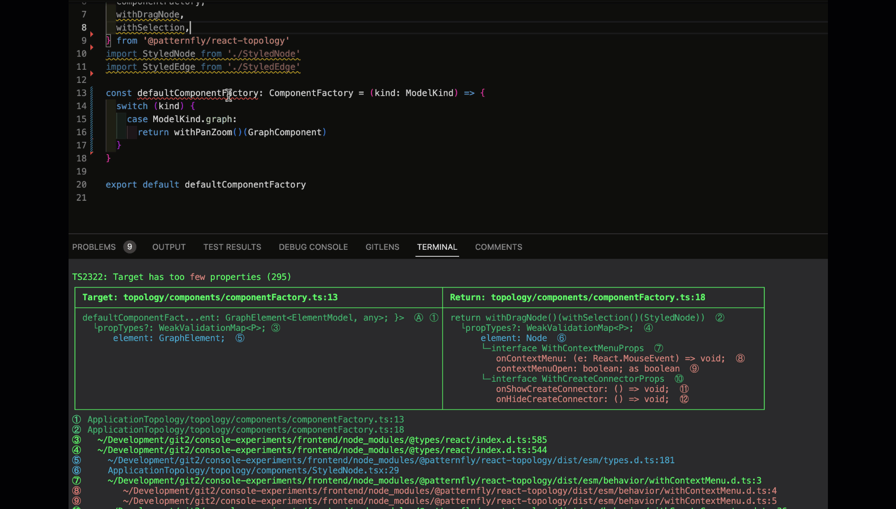
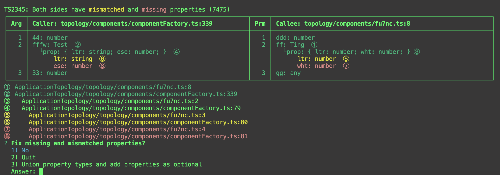

# ts-type-diagnostic

## Show Typescript assignment errors in a conflict table.

<br/>

This is a global npm tool that runs in the terminal and uses the Typescript [Compiler API](https://github.com/microsoft/TypeScript/wiki/Using-the-Compiler-API) to generate a conflict table with links.

<br/>

### IOW Instead of a multiline hover error like this, a table that shows the conflicting types with links that bring you to their declaration.



<br/>

In some cases this tool can also fix the problem.


# Installation

```shell
# Global installation is recommended.
npm install -g ts-type-diagnostic
```

# Usage

## Command Line

```shell
# Create a conflict table for a ts file with assignment errors.
tstd file.ts

# Create a verbose table.
tstd --v file.ts
```

## <br/><br/>

# Semantic Errors

Most Typescript errors are easy to fix--they're on the same line they occur:

```shell
const A: number;
# Can't assign A to B.
const B: string = A;
```

But where do you look if A is:

- declared on another line, perhaps in another file, perhaps in another package
- is a return type and B on another line, perhaps in another file, perhaps in another package
- A and B are both type shapes with mismatched or missing properties
- B is an array and A is an array item

<br/>
The hover error might not even mention any of the variables on the line on which it appears:

```shell
  # Type FC<Node> is not assignable to ShapeComponent.
   # Type of 'props' and 'props' are unassignable
    # England is the capital of France
  return NodeShape
```

<br/>
When you encounter these types of errors for the first time, and especially after you've studied them awhile, you'll come to realize that this is simply the compiler's way of saying 'yikes'. Advanced users are much more proficient at realizing they're about to have a bad day.
<br/><br/>
