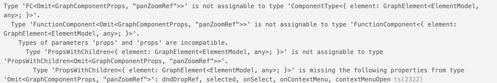
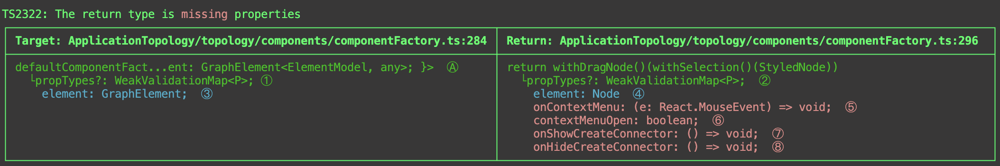
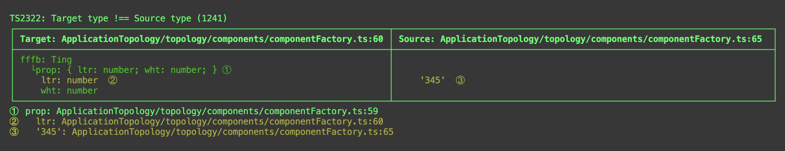
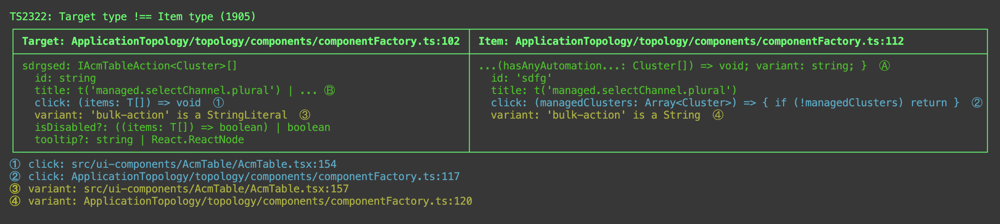
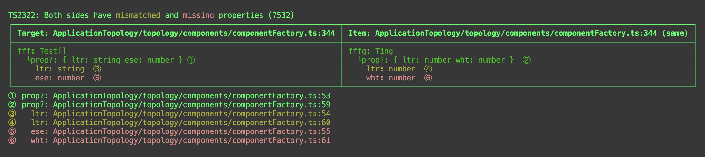
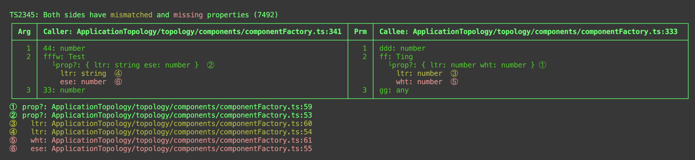

# ts-type-diagnostic

## Show Typescript assignment errors in a side-by-side table.

<br/>

TSTD is a global npm tool that runs in the terminal and uses the Typescript [Compiler API](https://github.com/microsoft/TypeScript/wiki/Using-the-Compiler-API) to generate a table that shows type conflicts side-by-side.

<br/>

### IOW Instead of this:



<br/>

### Something like this:


<br/><br/>

### If there's an assignment mismatch with a object property

```shell
fffb!.prop!.ltr = '345'
```


<br/><br/>

### When string literal !== string:


<br/><br/>

### When type shape conflicts have both missing and mismatched properties:

```shell
let fffg: Ting
let fff: Test[] = [fffg]
```


<br/><br/>

### When a calling argument also has missing and mismatched properties:

```shell
fu7nc(44, fffw, 33)
```


<br/><br/>

### When a map is missing an index:

```shell
const secondValue: string = someObject[9]
```


<br/><br/>

# Installation

```shell
# Globally is recommended.
npm install -g ts-type-diagnostic
```

# Usage

## Command Line

```shell
# Create a side-by-side table for a ts file with an assignment error.
tstd file.ts

# Create a verbose table.
tstd --v file.ts
```

## <br/><br/>

# tl:dr; Semantic Errors

Most Typescript errors are easy to fix--they're on the same line they occur:

```shell
const A: number;
# Can't assign A to B.
const B: string = A;
```

But where do you look if A is:

- declared on another line, perhaps in another file, perhaps in another package
- is a return type and B on another line, perhaps in another file, perhaps in another package
- A and B are both type shapes with mismatched or missing properties
- B is an array and A is an array item

Where do you look when A and B are used in a function.

```shell
const B = 123
# Can't call func with number.
func(B)
...
function func(A: string) { ... }
```

<br/>
Now imagine that B is a type shape created with OMITs, PARTIALs, etc and A is also created with special types such that properties are transient, and A is a return type on a B function, and A is in conflict with B?

<br/>

Then you might get an error like this:


<br/>
Which might appear on a line that doesn't mention any of the properties in the error message:

```shell
  # Type FC<Node> is not assignable to ShapeComponent.
   # Type of 'props' and 'props' are unassignable
    # England is the capital of France
  return NodeShape
```

<br/>
When you encounter these types of errors for the first time, and especially after you've studied them awhile, you'll come to realize that this is simply the compiler's way of saying 'yikes'. Advanced users are much more proficient at realizing they're about to have a bad day.
<br/><br/>

# What TSTD does

Instead of trying to reformat the Typescript diagnostic message to make more sense, TSTD tosses that message and with the help of the Typescript compiler api re-runs the comparison in order to generate a new side-by-side table:
<br/>


**What's shown:**

- The title is a simplified version of the error message
- The columns represent B (aka Target) on the left and A (aka Source) on the right
- The column headers include a link to the declaration of B, A

**Table content:**

- If a simple type is in conflict (string!==number), the content will be a single line
- When the conflict is a type shape, TSTD will add lines for each property in that type
- If a type's property is defined with a type shape, indented lines are added for those properties
- TSTD will continue to dig down until it finds a conflict

**Table colors/colours:**

- green - type matches
- yellow - type mismatch (ex: string !== number; string literal !== string)
- red - property is missing from one type
- cyan - property has a type shape which won't be checked until the other properties on this level are resolved

**Table notes:**

- For mismatched or missing properties, a link is provided to its declaration in the source
- Lines that are too long to fit in the table are concatenated and shown in its entirety in a note
- Sometimes a suggestion is added on how to fix the problem

<br/><br/>

# How TSTD works

TSTD is also known as "The Hound" (TH)

1. When you "release the hound", it runs the Typescript (TS) compiler on the provided file. If TS finds any semantic errors, TH iterates through them. Although TH doesn't use the original TS error message, it does use the error location. This guarantees that unless TS thinks it's a problem, TH doesn't either.
2. The TS error location is really intended just to know where to put the red squiggly line in the editor, but that doesn't work for a side-by-side comparision--when you just have one location what do you put on the other side :). So TH starts with the original error location and finds the two closest types that can be in conflict. It could be on the same line, it could be a call's declared return type and the type of variable that's being returned. It could be an array into which you are inserting an array element.

3. Once the two types are identified, TH compares them with an algorithm similar to TS, except that TH saves more metrics.

   - If a variable's type is a shape (contains properties), TH recurses into that shape and keeps a stack of what type it's within
   - If a property is missing on one side, but optional on the other side--no error
   - However if a property is provided, it's type MUST match the optional side
   - If a type is an array, it recurses into both arrays
   - If the type is within a call, TH iterates through all of the arguments in that call.
   - If the target type is a union of types (string | number) TH iterates through all possible types to see if one matches--if none match, TH finds the closest mismatch. If nothing is close TH shows all of the types in the table.
   - Compares to see if one side is a literal and the other side is not (IOW 'frank' !== 'frank' if only one 'frank' is a string literal)

4. Type shape comparisons are done breadth first instead of depth first-- which means if TH encounters a property declared with a type shape, it doesn't recurse into that shape unless all the sibiling properties match. If they don't match, TH stops there (just like TS) and shows the unchecked property as cyan in the table. Once you fix all the problems at that depth, the next time you run TH, it will continue recursing into the cyan properties. IOW, fixing problems at the top will start to uncover problems at the bottom.
5. Once a problem is found, TH uses the TS compiler to fill in any details including links into the declarations in the source and parent declarations.

6. TH then generates the table, links, notes, and suggested fixes.
